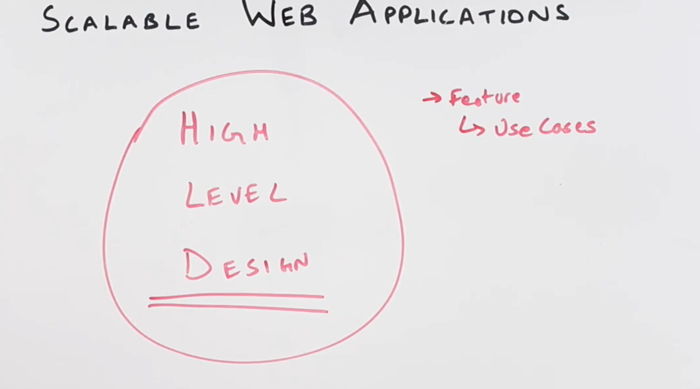
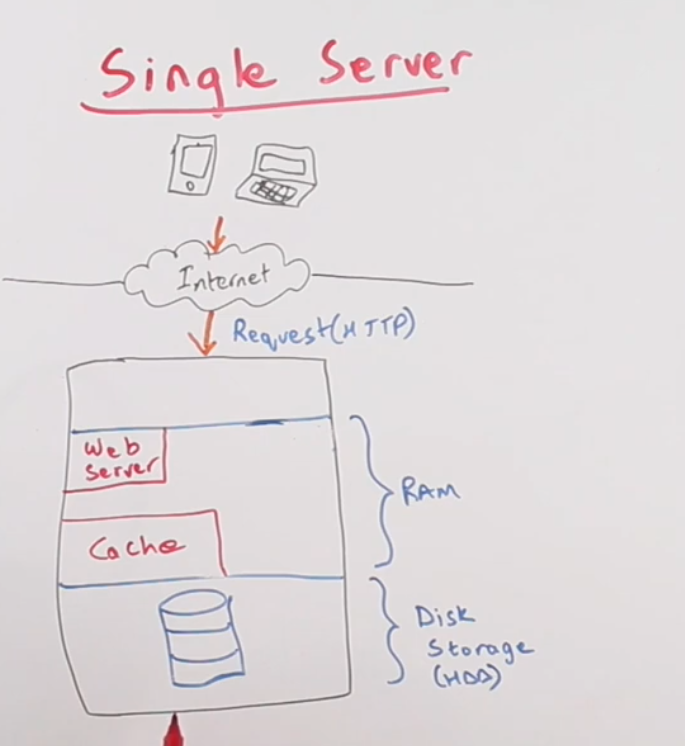

# 9 March

## Anatomy of scable web application

1. In interview, they can ask implement facebook, gmail etc.
2. First thing you need to do to ask what are the features?
3. We need to come up with high level design
   
4. Non-scable application

- Client is sending the request to server
  
- Web service is running in part of RAM, We have cache for popular requests.
- Note: Looksup in secondary memory is very slow.
- Usually application has task queue because sometimes user doesn't need immediate response for example user 1 likes user 2 picture.
  
- Task queues usually have a worker which will pick up tasks from queue and store it in cache or secondary memory.
- As the number of requests increase there will be backlog in request processing.

5. Final diagram
   

## 