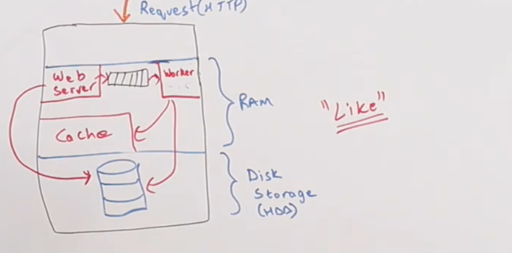
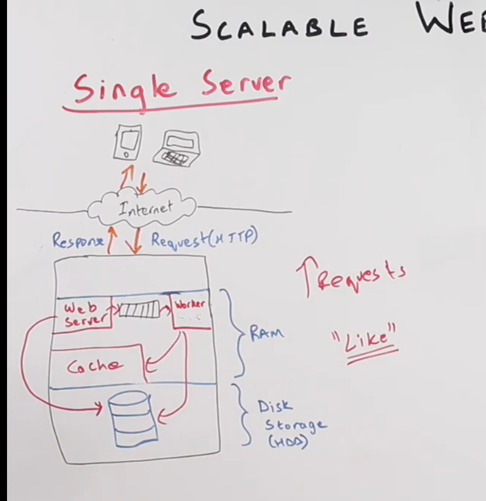

# 9 March

## Anatomy of scable web application

1. In interview, they can ask implement facebook, gmail etc.
2. First thing you need to do to ask what are the features?
3. We need to come up with high level design
   
4. Non-scable application

- Client is sending the request to server
  
- Web service is running in part of RAM, We have cache for popular requests.
- Note: Looksup in secondary memory is very slow.
- Usually application has task queue because sometimes user doesn't need immediate response for example user 1 likes user 2 picture.
  
- Task queues usually have a worker which will pick up tasks from queue and store it in cache or secondary memory.
- As the number of requests increase there will be backlog in request processing.

5. Final diagram
   

## Anatomy of scable web application 2

1. There are two ways of scaling a web application

- Vertical
- Horizontal

2. In vertical scaling we keep increasing the power of server like adding more RAM, disk storage etc.

- It becomes very impractical when application grows.

3. Horizontals brings the multiple server model concept

- This is not good model where we have same server connected with load balancer. It is inefficient because there is overhead suppose Machine A want to connect with Machine C cache or vice versa.
  

4. This is standard model used in industry nowadays for scaling

- We have load balancer like below, It's job is to route the request to free app server.
  

- We will add another layer i.e Distributed databases. Our app server access these to perform calculation. It can be SQL/No-SQL database.
  
- We have now added the caching layer and task queue layer. We need task queue to support asynchronous task and to reduce latency of request.
  

- We can add one more layer i.e Data processing which will be responsible for data analytics.
  

  
